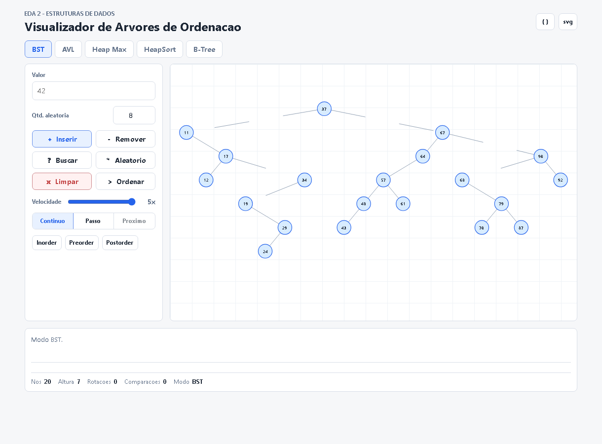
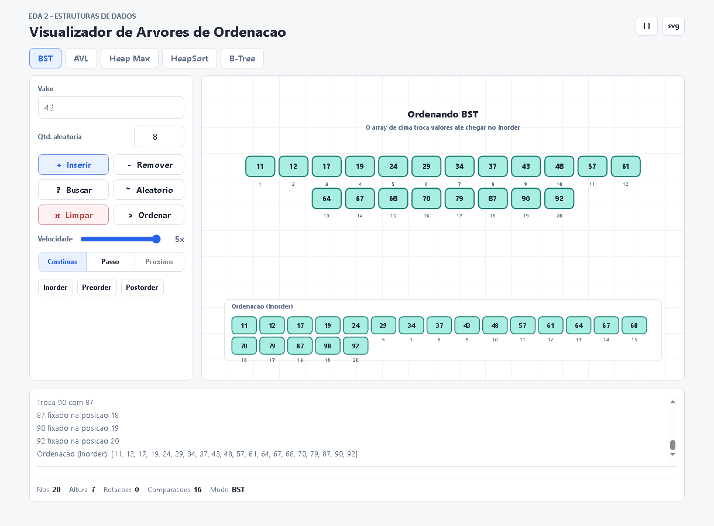
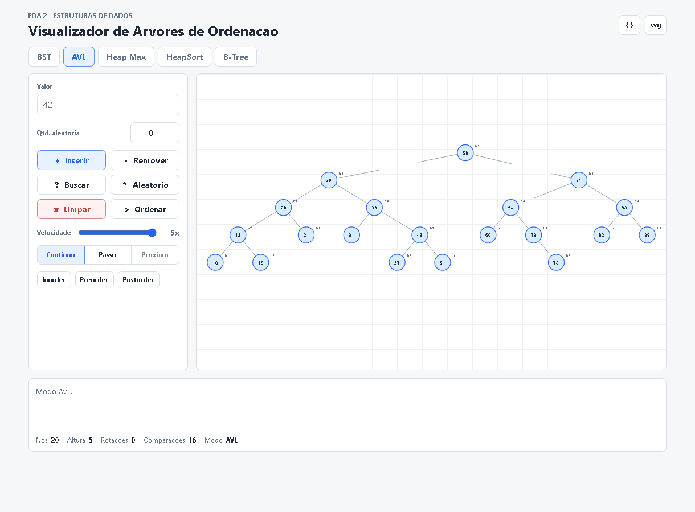
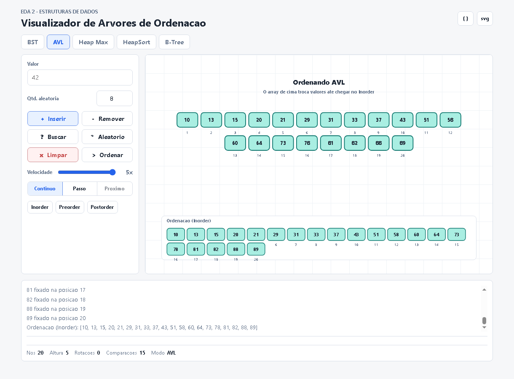
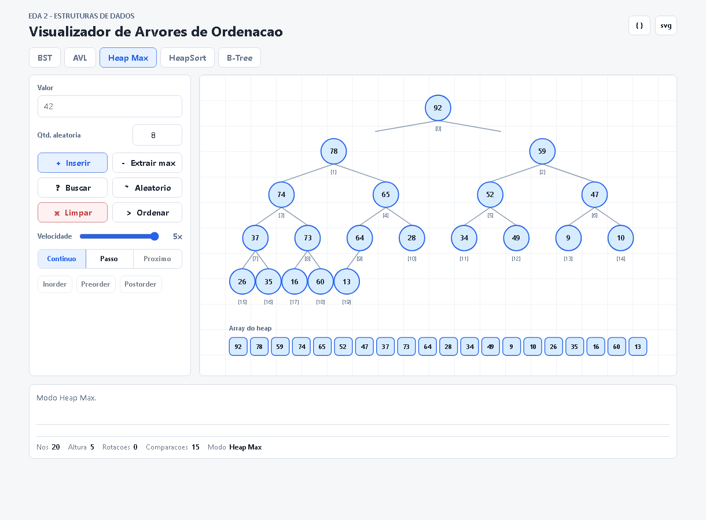
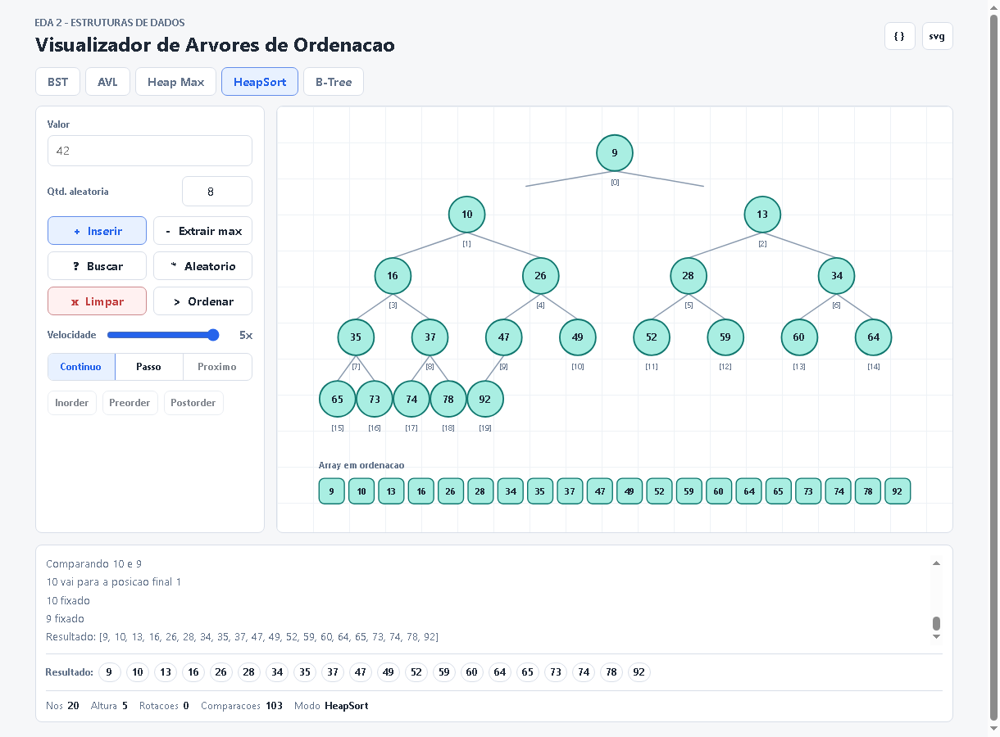
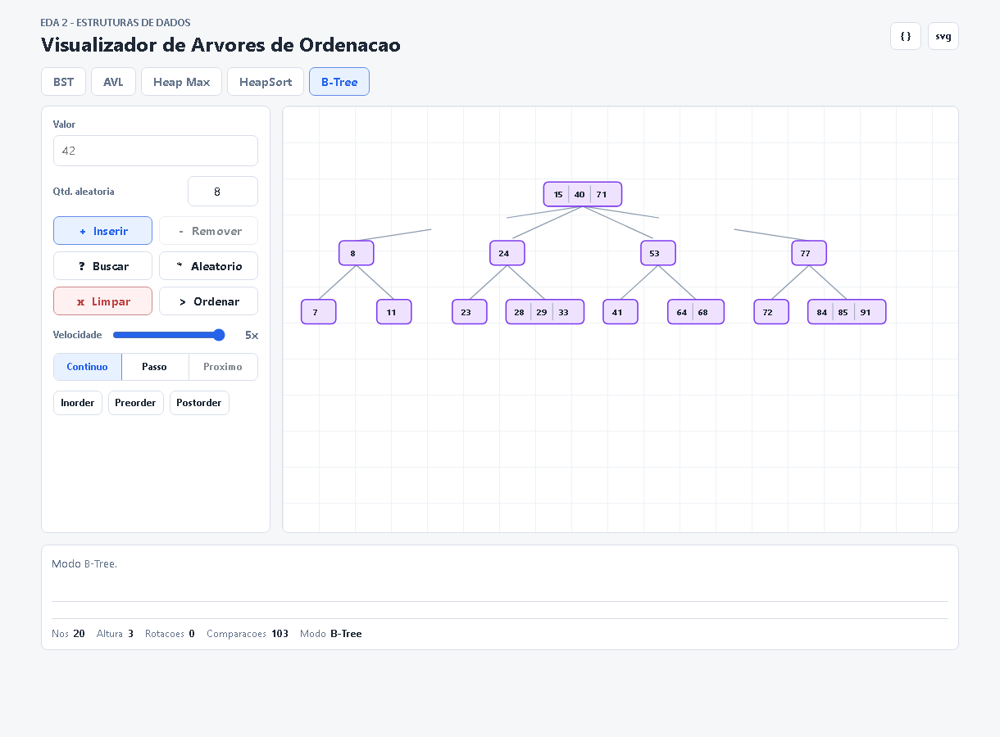
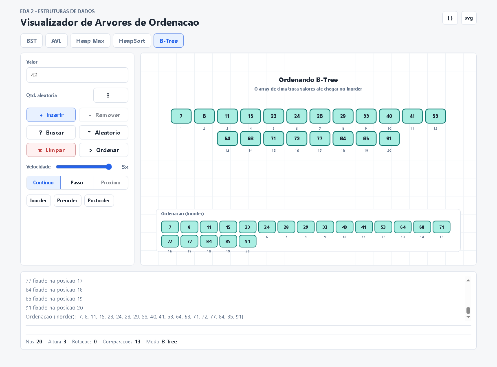

# G6_Arvore_EDA2-2026.1

Conteudo da Disciplina: Arvores de Ordenacao e Estruturas de Dados (BST, AVL, Heap, HeapSort, B-Tree)

## Alunos

| Matricula | Aluno |
| -- | -- |
| 211030630 | Paulo Henrique Virgilio Cerqueira |
| 211061529 | Carlos Henrique de Souza Bispo |

## Sobre

Este projeto implementa um visualizador web interativo para arvores e estruturas de ordenacao, desenvolvido para a disciplina de EDA 2.

O sistema permite:

- Inserir, buscar e remover valores em arvores binarias de busca.
- Visualizar BST, AVL, Heap Max, HeapSort e B-Tree.
- Acompanhar animacoes de insercao, comparacao, rotacao, troca e ordenacao.
- Executar percursos Inorder, Preorder e Postorder com visualizacao interativa.
- Ordenar BST, AVL e B-Tree usando o percurso Inorder.
- Executar HeapSort animado a partir do Heap Max.
- Escolher a quantidade de valores aleatorios inseridos na estrutura.
- Controlar a velocidade da animacao e alternar entre modo continuo e passo a passo.
- Exportar o estado atual em JSON e a visualizacao em SVG.

## Screenshots

As imagens abaixo mostram o projeto em funcionamento.

### BST





### AVL





### Heap Max e HeapSort





### B-Tree





## Instalacao

Linguagem: HTML, CSS e JavaScript<br>

Pre-requisitos:

- Navegador moderno, como Edge, Chrome ou Firefox.

Este projeto nao possui dependencias externas obrigatorias. Para executar, basta abrir o arquivo:

```bash
index.html
```

Opcionalmente, abra a pasta no VS Code e utilize a extensao Live Server.

## Uso

1. Abra o arquivo `index.html` no navegador.
2. Escolha a estrutura desejada: BST, AVL, Heap Max, HeapSort ou B-Tree.
3. Digite um valor e clique em `Inserir`, ou defina `Qtd. aleatoria` e clique em `Aleatorio`.
4. Use `Buscar`, `Remover` ou `Extrair max`, conforme a estrutura selecionada.
5. Clique em `Inorder`, `Preorder` ou `Postorder` para visualizar percursos.
6. Clique em `Ordenar` para acompanhar a ordenacao:
   - BST, AVL e B-Tree usam Inorder.
   - Heap Max utiliza HeapSort.
7. Ajuste a velocidade pelo controle `Velocidade`.
8. Use `Continuo`, `Passo` e `Proximo` para controlar a animacao.

Observacao:

- O percurso Inorder em BST, AVL e B-Tree exibe os valores em ordem crescente.
- A AVL mostra rotacoes e alturas dos nos durante a construcao.
- O HeapSort mostra as trocas no heap e no array de ordenacao.

## Video de explicacao do projeto

<p align="center">
  <a href="https://www.youtube.com/watch?v=wm5dVG0IBjI
YouTube">
    
  </a>
</p>

### Link do Video Gravado

> Video da entrega:
> **https://www.youtube.com/watch?v=wm5dVG0IBjI**
